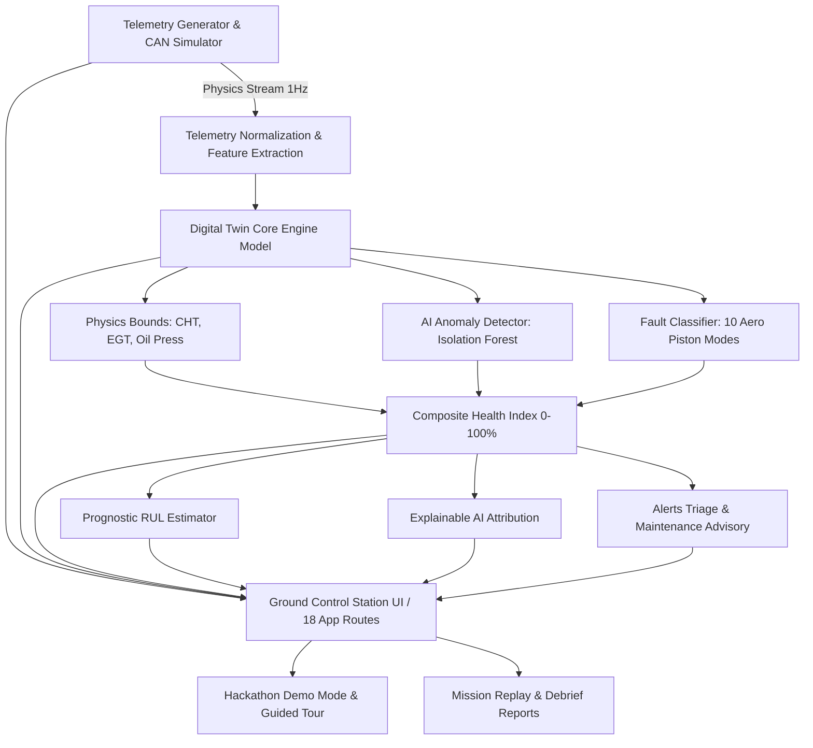

# AEGIS-TWIN

**AI-Enabled Real-Time Digital Twin System for Health Monitoring, Fault Prediction and Mission Reliability Enhancement of Aero Piston Engines used in MALE UAVs**

*Developed as an Aerospace Propulsion Health Software Demonstrator for DRDO / Department of Defence Production / iDEX*

---

> [!IMPORTANT]
> **RESEARCH & DEMONSTRATOR DISCLAIMER**:
> AEGIS-TWIN is a software demonstrator using simulated/synthetic engine telemetry and physics-inspired models. It is designed for research, development, mission simulation, and demonstration purposes. It is **not** certified for real flight control, safety-critical aerospace operation, or actual military operational deployment.

---

## 1. Executive Summary & Product Vision

**AEGIS-TWIN** is a Ground Control Station (GCS) and Propulsion Health Monitoring Digital Twin platform tailored for medium-altitude long-endurance (MALE) UAV aero piston engines (such as the turbocharged 4-stroke engines powering DRDO Tapas-BH-201 / Rustom-II equivalents).

The platform continuously synchronizes a virtual representation of the propulsion system with 18+ high-rate telemetry channels, providing:
- Component-level virtual engine state machine across 9 subsystems
- Hybrid AI Anomaly Detection combining Isolation Forest decision surfaces with thermodynamic physics residual bounds
- Pattern-matching fault classification across 10 critical aero piston failure modes
- Explainable AI (XAI) transparent parameter contribution attribution
- Prognostic Remaining Useful Life (RUL) wear modeling with 90% confidence horizons
- Operational flight simulator and black-box mission replay scrubber
- Condition-based maintenance advisory queue and printable mission debrief reports
- Virtual Aerospace CAN 2.0B / J1939 broadcast bus simulator ready for SocketCAN integration

---

## 2. System Architecture



---

## 3. Technology Stack

- **Frontend & App Framework**: Next.js 15 (App Router), React 19, TypeScript
- **Styling & Design System**: Tailwind CSS (Aerospace Command Center Dark Theme `#070b14`), Lucide Icons
- **Interactive Visualization**: Recharts (Responsive Time-Series Charts & Envelopes), SVG Virtual Digital Twin Schematic
- **Real-Time Pipeline**: Deterministic 4-stroke physics model, reactive in-memory state store (`lib/store.ts`)
- **Machine Learning**: Python companion suite (`scikit-learn`, `numpy`, `pandas`) + Client/Server hybrid inference engine
- **Avionics Protocol**: Simulated Aerospace CAN 2.0B / SAE J1939 parameter groups (PGNs)
- **Deployment**: 100% Vercel / Node.js compatible (zero native binary lock-in)

---

## 4. Application Routes & Navigation

| Route | Page Name | Primary Capability |
| :--- | :--- | :--- |
| `/` | Landing Page | Executive overview, capability cards, launch CTA |
| `/login` | Authentication | Role-based clearance with 1-click demo presets |
| `/dashboard` | Executive Overview | 8 KPI cards, composite health ring, streaming telemetry charts |
| `/digital-twin` | Live Digital Twin | Interactive 9-subsystem virtual engine schematic & inspector |
| `/health` | Engine Health Index | Weighted multi-tier health formulation & threshold standards |
| `/telemetry` | Real-Time Telemetry | Tabular 24-channel parameter feed & 4-cylinder thermal balance |
| `/diagnostics` | AI Diagnostics (XAI) | Isolation Forest anomaly score & XAI factor contribution waterfall |
| `/rul` | RUL Prediction | Non-linear degradation wear curve & +50h, +100h milestones |
| `/mission-simulator` | Mission Simulator | Flight state selector, ISA/Hot/High-Alt presets, safety margins |
| `/mission-replay` | Mission Replay | Black-box playback scrubber with 0.5x to 10x speeds |
| `/fault-analysis` | Fault Analysis | Deep classification matching for 10 aero piston fault modes |
| `/fault-lab` | Fault Injection Lab | 1-click interactive test bench for active failure simulation |
| `/maintenance` | Maintenance Advisory | Condition-based advisory queue with priority triage |
| `/historical-trends` | Historical Trends | Multi-mission comparative benchmarks and fuel efficiency logs |
| `/performance` | Engine Performance | Thermodynamic envelope mapping (RPM, EGT, Fuel Flow vs Load) |
| `/alerts` | Alerts Center | Real-time incident logging, search, filtering, and acknowledgment |
| `/can-bus` | Software CAN Bus | 29-bit CAN 2.0B frame broadcaster and arbitrary frame injector |
| `/reports` | Mission Reports | Printable / PDF exportable post-flight engineering debrief |
| `/data-management` | Data Management | CSV flight log uploader, schema validator, and sample downloads |
| `/admin` | Admin & Parameters | Engine thermodynamic coefficient calibration & role manager |
| `/architecture` | System Architecture | 7-layer end-to-end hardware-to-cloud topology overview |

---

## 5. Demo Credentials (One-Click Available on `/login`)

| Role | Username | Permissions |
| :--- | :--- | :--- |
| **ADMIN** | `admin.drdo@aegis.mil` | Full GCS access, coefficient calibration, fault injection |
| **OPERATOR** | `operator.gcs@aegis.mil` | Real-time telemetry, mission tracking, digital twin |
| **MAINTENANCE ENGINEER** | `maint.eng@aegis.mil` | Health degradation index, fault analysis, advisory queue |
| **ANALYST** | `analyst.flight@aegis.mil` | Historical mission comparison, performance curves, reports |

---

## 6. Quick Start & Installation

### Prerequisites
- Node.js >= 18.0 (Tested on Node v26)
- Python >= 3.10 (for optional ML companion training)

### Step 1: Install Dependencies
```bash
npm install
```

### Step 2: Run the Development Server
```bash
npm run dev
```
Open [http://localhost:3000](http://localhost:3000) in your browser.

### Step 3: Production Build
```bash
npm run build
npm start
```

---

## 7. Python ML Suite & Synthetic Datasets

The companion `/ml` directory provides a standalone machine learning pipeline:

```bash
# 1. Generate 3,800 rows of multi-scenario synthetic flight logs
python ml/generate_datasets.py

# 2. Train the Isolation Forest anomaly detector
python ml/train.py

# 3. Evaluate model accuracy, precision, recall & F1 score
python ml/evaluate.py

# 4. Run CLI sample inference
python ml/predict.py
```

Generated datasets are located in `public/data/`:
- `normal_engine.csv`
- `degraded_engine.csv`
- `overheating.csv`
- `vibration_fault.csv`
- `sensor_drift.csv`
- `misfire.csv`

---

## 8. REST API Documentation

The platform includes production-ready JSON endpoints:

- `GET /api/engine/status`: Returns current engine RPM, state, composite health, and anomaly score.
- `GET /api/telemetry/live`: Returns latest 24-channel telemetry frame and active CAN frames.
- `GET /api/health`: Returns 9-subsystem health scores and confidence metrics.
- `GET /api/anomalies`: Returns computed anomaly score and explainable AI parameter contributions.
- `GET /api/faults`: Returns active classified fault conditions.
- `POST /api/faults`: Injects or clears simulated faults via JSON payload (`{"type": "MISFIRE", "action": "INJECT"}`).
- `GET /api/rul`: Returns estimated RUL hours, confidence bounds, and projected milestones.
- `GET /api/maintenance`: Returns prioritized maintenance recommendations.
- `GET /api/missions`: Returns list of historical and active sorties.

---

## 9. Hackathon Presentation & Live Demo Flow

To deliver a 3-5 minute live demonstration for evaluators or judges:
1. Click the **"HACKATHON TOUR"** button in the top navigation header.
2. Follow the 6 guided milestones:
   - **Step 1 (Telemetry Baseline)**: Observe nominal cruise telemetry at 4650 RPM over virtual CAN.
   - **Step 2 (Digital Twin)**: Inspect 9 virtual subsystems and click on Combustion to review CHT/EGT balance.
   - **Step 3 (AI Anomaly Detection)**: Click the action to inject an Overheating anomaly; watch the anomaly score spike from 0.12 to 0.85+.
   - **Step 4 (Explainable AI & Faults)**: Review the XAI factor contribution waterfall (+31% EGT, +24% CHT) and fault classification.
   - **Step 5 (RUL Forecasting)**: See how active thermal wear accelerates the degradation rate and shortens remaining hours.
   - **Step 6 (Maintenance & Report)**: Review the automatically generated advisory directive and export the printable Mission Report.

---

## 10. Hardware & CAN Bus Integration Roadmap

While AEGIS-TWIN currently generates deterministic CAN 2.0B frames in software, the architecture provides clean drop-in points for physical hardware:
- **Linux SocketCAN**: The frame structures in `lib/engine/canSimulator.ts` map directly to `can_frame` C structures.
- **Microcontroller Edge Interface**: A lightweight ESP32 / STM32 bridge can forward physical CAN packets to the Next.js API via WebSockets.
- **Database Scalability**: Designed for zero-downtime migration from in-memory state to TimescaleDB or PostgreSQL using Prisma/Drizzle.
